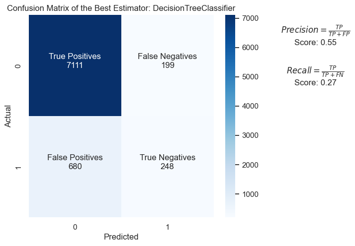

# Banking Marketing -  Comparing Classifiers

**Overview**: In this practical application, my goal is to compare the performance of the K Nearest Neighbor, Logistic Regression, Decision Trees, and Support Vector Machines classifiers. In this project I utilize a dataset related to marketing bank products over the telephone. 

The dataset comes from the UCI Machine Learning repository [link](https://archive.ics.uci.edu/ml/datasets/bank+marketing).  The data is from a Portuguese banking institution and is a collection of the results of multiple marketing campaigns.  I will make use of the article accompanying the dataset [here](CRISP-DM-BANK.pdf) for more information on the data and features.

**You can access the notebook [here](bank_marketing.ipynb).**

In this project I follow the CRISP-DM methodology: 


### Understanding the Data

The data is related with direct marketing campaigns (phone calls) of a Portuguese banking institution. The classification goal is to predict if the client will subscribe (yes/no) a term deposit (variable y). The marketing campaigns were based on phone calls. Often, more than one contact to the same client was required, in order to access if the product (bank term deposit) would be ('yes') or not ('no') subscribed.

There are four datasets:
1) bank-additional-full.csv with all examples (41188) and 20 inputs, ordered by date, very close to the data analyzed in [Moro et al., 2014]
2) bank-additional.csv with 10% of the examples (4119), randomly selected from 1), and 20 inputs.
3) bank-full.csv with all examples and 17 inputs, ordered by date (older version of this dataset with less inputs).
4) bank.csv with 10% of the examples and 17 inputs, randomly selected from 3 (older version of this dataset with less inputs).
   The smallest datasets are provided to test more computationally demanding machine learning algorithms (e.g., SVM).

**For this specific project the bank-additional-full.csv dataset will be used**.

Additional information:

According to the provided paper, the dataset collected is related to 17 campaigns that occurred between May 2008 and November 2010. During these phone campaigns, an attractive long-term deposit application, with good interest rates, was offered. For each contact, a large number of attributes was stored and if there was a success (the target variable). For the whole database considered in the paper, there were 6499 successes (8% success rate).

Note: The success rate in the dataset used is slightly different.

Specifically the **Failure and Success rate of the campaign is**:
- The failure rate of the marketing campaign is: 88.7%
- The success rate of the marketing campaign is: 11.3%


### Understanding the Features
Below the data description is demonstrated:

```
Input variables:
# bank client data:
1 - age (numeric)
2 - job : type of job (categorical: 'admin.','blue-collar','entrepreneur','housemaid','management','retired','self-employed','services','student','technician','unemployed','unknown')
3 - marital : marital status (categorical: 'divorced','married','single','unknown'; note: 'divorced' means divorced or widowed)
4 - education (categorical: 'basic.4y','basic.6y','basic.9y','high.school','illiterate','professional.course','university.degree','unknown')
5 - default: has credit in default? (categorical: 'no','yes','unknown')
6 - housing: has housing loan? (categorical: 'no','yes','unknown')
7 - loan: has personal loan? (categorical: 'no','yes','unknown')


# related with the last contact of the current campaign:
8 - contact: contact communication type (categorical: 'cellular','telephone')
9 - month: last contact month of year (categorical: 'jan', 'feb', 'mar', ..., 'nov', 'dec')
10 - day_of_week: last contact day of the week (categorical: 'mon','tue','wed','thu','fri')
11 - duration: last contact duration, in seconds (numeric). Important note: this attribute highly affects the output target (e.g., if duration=0 then y='no'). Yet, the duration is not known before a call is performed. Also, after the end of the call y is obviously known. Thus, this input should only be included for benchmark purposes and should be discarded if the intention is to have a realistic predictive model.


# other attributes:
12 - campaign: number of contacts performed during this campaign and for this client (numeric, includes last contact)
13 - pdays: number of days that passed by after the client was last contacted from a previous campaign (numeric; 999 means client was not previously contacted)
14 - previous: number of contacts performed before this campaign and for this client (numeric)
15 - poutcome: outcome of the previous marketing campaign (categorical: 'failure','nonexistent','success')


# social and economic context attributes
16 - emp.var.rate: employment variation rate - quarterly indicator (numeric)
17 - cons.price.idx: consumer price index - monthly indicator (numeric)
18 - cons.conf.idx: consumer confidence index - monthly indicator (numeric)
19 - euribor3m: euribor 3 month rate - daily indicator (numeric)
20 - nr.employed: number of employees - quarterly indicator (numeric)


Output variable (desired target):
21 - y - has the client subscribed a term deposit? (binary: 'yes','no')
```

**According to the above data description**:

- **Numeric Variables**: 'age', 'duration', 'campaign', 'pdays', 'previous', 'emp.var.rate', 'cons.price.idx', 'cons.conf.idx', 'euribor3m', and 'nr.employed' are described as numeric. Before proceeding, I should confirm if they are correctly stored as integers or floats. If I find any anomalies (like numeric values stored as strings), coercion to the correct datatype will be required.

- **Categorical Variables**: Variables like 'job', 'marital', 'education', 'default', 'housing', 'loan', 'contact', 'month', 'day_of_week', and 'poutcome' are described as categorical. I should ensure these are appropriately categorized, and consider encoding them using techniques like one-hot encoding or ordinal encoding, based on my analysis or modelling requirements.

- **(Optional) Unknown Values**: I noticed that for some categorical variables like 'job', 'marital', 'education', 'default', 'housing', and 'loan' there is an 'unknown' category. Depending on the context and the analysis requirement, these 'unknown' categories might be treated as missing values.

- **Special Notes**: The 'duration' variable should be dropped - the description suggests avoiding usage of this variable if the intention is to create a predictive model.

- **Output Variable**: The output variable 'y' is binary and may need to be encoded to 0 and 1 if the modeling technique I plan to use requires numerical input.


### Understanding the Task

#### Business Objective:

**To develop a predictive model that can help the bank identify potential customers who are likely to subscribe to a term deposit. Such a model can help the bank focus its marketing efforts more efficiently, targeting those customers that are most likely to respond positively.**

Given this business objective, I may want to prioritize Precision and also consider Recall. Here's why:

- **Precision**: This measure gives me the proportion of true positives (potential customers who were correctly identified as likely to subscribe) out of the total predicted positives. A high precision indicates lower false positive rate i.e., the model's positive predictions are reliable, so the bank will waste less time and resources marketing to people who are unlikely to subscribe.

- **Recall** (Sensitivity): I might also consider this measure, especially if it's important for the bank not to miss out on potential subscriptions. Recall measures the proportion of actual positives (all potential customers who would subscribe) that were identified correctly. A higher Recall indicates fewer missed opportunities for new term deposits.

These two metrics usually have a trade-off, so depending on the bank's marketing strategy and capacity, I might want to balance between them. For instance, if the bank has a limited marketing budget and wants to be very precision-targeted, Precision will be more significant. But, if they fear to miss out potential customers and can afford to take some risks in targeting, higher Recall will be beneficial.

Note: If the bank wants to balance these two, then I could use the **F1 Score** (the harmonic mean of Precision and Recall) that gives equal weight to both Precision and Recall.

Moreover, I should consider using the **Area Under the Receiver Operating Characteristic Curve (AUC-ROC)**, as it provides a good measure of separability of classes and is robust against imbalanced data.


### Cleaning Data and Feature Engineering
Various approaches were implemented on these tasks, some of them are demonstrated below:
- The dataset was already cleaned. A new feature was created named **contacted_before**. Also, the **duration** feature was dropped in order to ensure the creation of realistic predictive model.
- Generally, the techniques that I used to prepare the features for the modelling phase were One Hot Encoding and Ordinal Encoding for categorical features. In addition, all numerical variables were Standardised.
- Lastly, I used PCA to compress emp.var.rate, cons.price.idx, cons.conf.idx, euribor3m and nr.employed features into 1 column.

For more information check the problem 3, 5, 11 sections of the notebook.


### Modelling Phase
Before building the models, I established a baseline that my classifiers should aim to beat:
- A typical method for setting a baseline for classification tasks is to use a simple model and compare the performance of more complex models against it.
- For binary classification, one common baseline method is the "Zero Rule" (ZeroR) or "Most Frequent" classifier. This classifier always predicts the most frequent class in the training dataset.
- I decided to calculate the maximum relative frequency of the unique values in the y_train data series, which can indicate the baseline accuracy of a model that always predicts the most common class.
- My calculated baseline accuracy was 88.73%

After applying various modelling and feature engineering approaches I concluded to the following models:

 Final Models       | training_time | train_accuracy | test_accuracy | recall | precision | f1_score |   
|-------------------|---------------|----------------|---------------|--------|-----------|----------|
| LR                | 0.78          | 0.90           | 0.90          | 0.18   | 0.69      | 0.29     |        
| KNN               | 0.11          | 0.91           | 0.90          | 0.26   | 0.55      | 0.35     |      
| DT with Ord. Enc. | 0.13          | 0.91           | 0.89          | 0.27   | 0.55      | 0.36     |
| DT with OH Enc.   | 0.45          | 0.91           | 0.89          | 0.29   | 0.56      | 0.38     |
| SVM               | 180.58        | 0.90           | 0.90          | 0.21   | 0.68      | 0.32     |

**Notes**:
- To find the optimal hyperparameters of every model I used the exhaustive Grid Search Algorithm. The target scoring of grid search algorithm was the **f1 score** as I **did not know the marketing strategy of the bank**.
- The values on the table above are rounded.


The ROC plot and AUC scores are shown below:


###  Choosing models to deploy
#### Evaluation of models and final decision:

After conducting a comprehensive analysis of various classifiers, including Logistic Regression, K Nearest Neighbors, Decision Trees (with One-Hot and Ordinal Encoding), and Support Vector Machine, I evaluated each model based on test and train accuracy, confusion matrix analysis, AUC score, ROC curve, F1 and Precision score. These metrics provided a holistic view of each model's performance, allowing me to assess their effectiveness in predicting successful outcomes for the bank marketing campaign.

**Evaluation Criteria**
To ensure a comprehensive comparison, I evaluated the models based on the following criteria:

- Accuracy: Both train and test accuracies were considered to assess the models' ability to generalize to unseen data.
- Confusion Matrix on the final models: Provided insight into the types of errors made by the models.
- AUC Score: The area under the ROC curve, measuring the models' ability to distinguish between classes. Because we have an imbalanced dataset the AUC score is a crucial metric for evaluating the models.
- ROC Curve: Illustrated the trade-off between the true positive rate and false positive rate.
- Precision Score: Evaluated the models' ability to predict the positive class without a significant number of false positive (direct marketing strategy).
- F1 Score: It is particularly useful when I care equally about Precision and Recall. It's a critical measure if the cost of false positives and false negatives is high.

**Model Selection**:
All models except from SVM achieved a good AUC score (above 0.7). Also, SVM is quite slow to train, so it seems a costly model. In other words, we should remove the SVM model as it is risky to deploy it.

Based on the analysis, the **Logistic Regression** is suitable for a direct marketing campaign strategy as it has a good precision score. Furthermore, Logistic Regression seems to generalise better than other final models (it has a small gap between training and test accuracy).
For a more balanced marketing campaign strategy we should choose the **Decision Tree model (with OH Encoding as a transformer)** as it achieved the best recall score.


**The structures of the chosen models/pipelines are presented below**:


The best parameters of the Logistic Regression model:
- C = 10
- penalty = L1
- estimator__solver = saga


The best parameters of the Decision Tree model (using One Hot Encoder in the preprocessing phase):
- estimator__criterion = gini,
- estimator__max_depth = None
- estimator__min_samples_leaf = 10


**Confusion Matrix of final Logistic Regression model:**


**Confusion Matrix of final Decision Tree model:**




### Final thoughts and next step recommendations:
While the current analysis provides a solid foundation for our marketing efforts, the ever-evolving nature of data and technology presents opportunities for further enhancement.
Below there are some recommendations for future work.

- **Exploring and applying State-of-the-Art Models**:

- **Deep Learning**: With the advancement in computational power and data availability, deep learning models, such as neural networks, could offer significant improvements in predictive accuracy. Techniques like convolutional neural networks (CNNs) for feature extraction and recurrent neural networks (RNNs) for sequence prediction could provide nuanced insights into customer behavior patterns.
- **Ensemble Methods**: Techniques like Gradient Boosting Machines (GBM), Random Forest, and XGBoost have shown to improve performance by combining multiple models to reduce variance and bias. Their application could potentially enhance the predictive power beyond the current models.

**Implementing a Problem Decomposition approach**:

- **Segmentation Analysis**: Breaking down the problem into smaller, more specific segments based on customer demographics (age, job, marital status) or previous campaign outcomes could reveal unique patterns within subgroups. This approach allows for tailored models that cater to the nuances of each segment, potentially improving overall campaign effectiveness.
- **Temporal Analysis**: Considering the time dimension in the dataset, such as month of contact or economic indicators, could yield insights into optimal timing for campaigns or the influence of external factors on success rates.

**Applying a Continuous Learning and Adaptation approach**:
- The marketing domain is dynamic, with customer preferences and economic conditions constantly evolving. It's crucial to adopt a continuous learning approach, where models are regularly updated and refined based on new data and insights.


